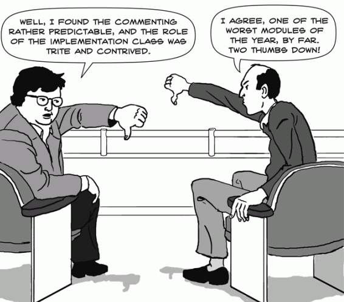

!SLIDE center transition=uncover
# How do we Review Code?

!SLIDE center transition=uncover
# Like a film critic right?

!SLIDE center transition=uncover
# Code Review is a conversation

!SLIDE center transition=uncover
# Reviewees

!SLIDE center transition=uncover
Smaller Pull Requests are better
-------
.notes It is much easier to review ten 100-line PRs than one 1000-line review.

!SLIDE center transition=uncover
Pre-review your code.
-------
.notes Take a quick glance over your code and see if there’s anything you would push back on if you were reviewing this code and fix it before sending for review.

!SLIDE center transition=uncover
You are not the code you developed
-------
.notes Don't take review comments personally
.notes Think of Code Review as a peer editing your research paper

!SLIDE center transition=uncover
Don't take every suggestion as a mandate
-------

!SLIDE center transition=uncover
If you feel strongly about something, defend it
-------

