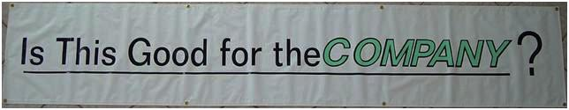
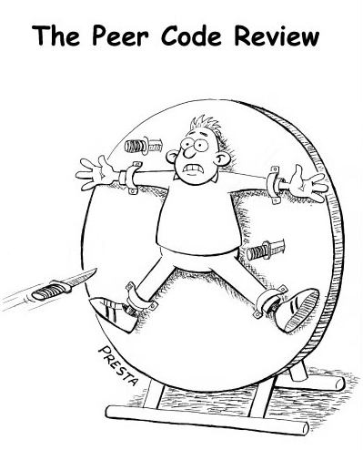
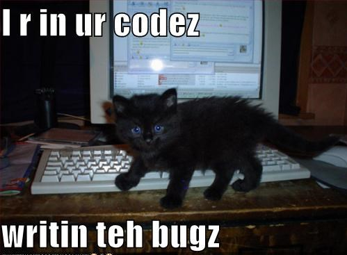
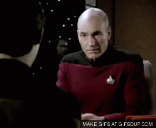

!SLIDE center transition=uncover

# Reviewing Code Review

!SLIDE center transition=uncover

# Why do we perform Code Reviews?

!SLIDE center transition=uncover

!SLIDE center transition=uncover
# YES

!SLIDE center transition=uncover

Bugs found early are cheaper to fix
------

!SLIDE center transition=uncover

Knowledge transfers among engineers
------

!SLIDE center transition=uncover

Engineers are more conscious while writing code
------

!SLIDE center transition=uncover

Provides a mechanism for engineers to receive feedback
------

!SLIDE center transition=uncover

Testing catches fewer bugs per hour than human inspection of code.
------
-Code Complete
------

!SLIDE center transition=uncover

!SLIDE center transition=uncover

Why do we require reviews for everything?
-------

!SLIDE center transition=uncover

To Avoid These
-------

.notes No reason to make a judgement call about what needs review
