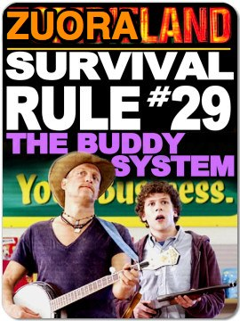

!SLIDE
# Zuora the Zessentials

!SLIDE bullets incremental transition=fade

# Goals
* Give some Zuora basics
* Explain how Zuora interacts with Ngin
* Zuora and Open Source

!SLIDE center .notes Zuora is a huge application. Its too big to cover in 20 minutes

!SLIDE bullets incremental transition=fade

# What is Zuora?
* .notes explain what somone would use zuora for

# Zuora is a very complex application

!SLIDE center

# The Basics

!SLIDE bullets incremental transition=fade

# Account
*
* Explain how Zuora interacts with Ngin
* Zuora and Open Source

