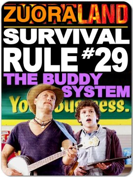

!SLIDE center

# Zuora the Zessentials

!SLIDE bullets incremental transition=uncover

# Goals
* Give some Zuora basics
* Explain how Zuora interacts with Ngin
* Zuora and the Open Source community

!SLIDE bullets incremental transition=uncover

# What is Zuora?

* Subscription based billing service
* Target market is software subscriptions
* Built with API integration in mind
* Solid but complex API

!SLIDE center transition=uncover

# Zuora is very complex

!SLIDE center transition=uncover

# The Basics

!SLIDE bullets incremental transition=uncover

# Important Sources

* [Zuora Knowledge Center](http://knowledgecenter.zuora.com/)
* [Zuora Support](https://support.zuora.com/)

